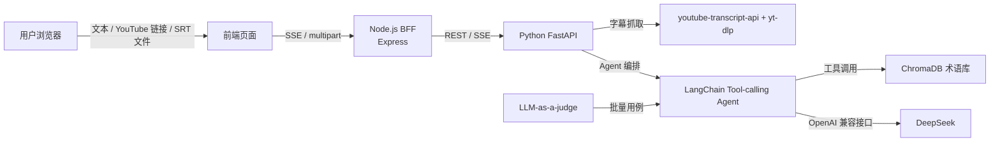

# AI 工程化与 Agent 架构报告

> 项目：垂直领域智能翻译 Agent（日语游戏 / ACG 视频字幕翻译）

## 1. 项目概述

### 1.1 背景与痛点

通用机器翻译在游戏 / ACG 垂直领域表现很差，主要难点在于：

- **游戏黑话**：如 `デバフ`、`バフ`、`ワンパン`，直译会丢失游戏机制含义。
- **缩写与外来语**：如 `CT`、`DPS`、`Tier1`，需要结合语境判断。
- **主播口语 / 网络梗**：如 `エグい`、`渋い`、`沼る`，字面意思和实际含义偏差很大。
- **同词多义**：如 `凸` 在不同游戏里可能是“命座 / 突破 / 星级”。

通用翻译模型缺乏这些领域知识，容易给出“看似通顺但意思错”的译文。

### 1.2 目标

构建一个前后端分离、具备自主规划能力的 AI Agent 翻译产品：

- 用 RAG 术语库为模型补充垂直领域知识。
- 用 Agent 的工具调用能力，让模型在“拿不准”时主动查术语库。
- 支持单句、YouTube 链接、字幕文件三种输入。
- 提供可视化的 Agent 思考过程与可量化的翻译质量评测。

## 2. 系统架构

### 2.1 总体架构

采用前后端分离 + BFF 模式：

### 2.2 分层职责

| 层 | 技术 | 职责 |
| --- | --- | --- |
| 前端 | HTML/CSS/JS | 交互 UI、SSE 消费、思考过程折叠展示。 |
| BFF | Node.js + Express | 流式转发、文件上传代理，作为前后端边界。 |
| 编排层 | Python + FastAPI | 字幕抓取、Agent 调用、SSE 输出。 |
| 智能层 | LangChain + ChromaDB | ReAct 工具调用 + RAG 术语检索。 |
| 模型层 | DeepSeek（OpenAI 兼容） | 实际语言理解与生成。 |

### 2.3 为什么这样分

- Node.js 擅长高并发 I/O 与流式转发，作为面向用户的 BFF。
- Python 生态对 LangChain / ChromaDB / 字幕处理支持最完善，作为 AI 编排层。
- 两层通过 REST + SSE 通信，边界清晰，可独立部署、独立扩展。

## 3. Agent 设计

### 3.1 ReAct 工具调用

使用 LangChain 的 `create_tool_calling_agent` + `AgentExecutor`，实现：

1. 接收输入文本。
2. 模型判断是否存在领域生词。
3. 若有，调用 `search_term_dict` 工具检索术语库（RAG）。
4. 结合检索结果生成地道译文。

System Prompt 明确要求“遇到疑难名词必须调用工具”，强约束 Agent 走 RAG 流程而非直接机翻。

### 3.2 RAG 术语库

- 术语数据按 domain 分文件维护在 `backend/app/data/terms/`，YouTube 翻译时自动选库检索。
- 每条包含：原词、别名、分类、推荐译法、含义、例句、易错提醒。
- 启动时载入 ChromaDB（内嵌进程内，默认 all-MiniLM-L6-v2 embedding）。
- 检索返回 Top-4 相关术语作为模型上下文。

### 3.3 防死循环

`AgentExecutor` 配置多重保护：

| 参数 | 默认 | 作用 |
| --- | --- | --- |
| `max_iterations` | 5 | 限制 ReAct 最大轮数。 |
| `max_execution_time` | 60s | 单次请求超时强制结束。 |
| `handle_parsing_errors` | True | 解析失败不崩溃，自我修正。 |
| `early_stopping_method` | force | 触发上限时强制收尾返回结果。 |

### 3.4 流式输出

后端通过 `astream_events` 截获 Agent 事件，转成两类 SSE 消息：

- `thought`：推理、工具调用、RAG 状态（前端默认折叠）。
- `token`：最终译文（前端默认展示）。

兼顾“可解释性（能展示 ReAct 过程）”与“产品体验（默认只看干净译文）”。

## 4. 关键功能实现

### 4.1 单句翻译

`GET /stream_translate?text=...`，流式返回 Agent 推理与译文。

### 4.2 YouTube 链接翻译

`GET /stream_translate_youtube?url=...`，难点在于字幕获取：

1. 优先用轻量 `youtube-transcript-api`。
2. 被 YouTube 拦截（`RequestBlocked`）时回退到 `yt-dlp`。
3. `yt-dlp` 通过浏览器 cookies 绕过 `Sign in to confirm` 机器人校验。
4. 过滤 `live_chat` 等非字幕轨道，下载真正字幕文件解析。
5. 完整字幕按字符数分块，逐块交给 Agent 翻译（非截断）。

只抓字幕、不下载视频、不做语音转写，避免范围扩张到 ASR 管线。

### 4.3 字幕文件翻译

`POST /api/translate-srt`，支持 `.srt`（逐条）与 `.txt`（逐行），返回翻译后文件下载。

## 5. 质量保障：LLM-as-a-judge

`eval/llm_judge.py` 实现自动化回归评测：

1. 20 条覆盖战斗 / 抽卡 / 版本环境 / 主播口语的术语用例。
2. 调用 Agent 翻译。
3. 用 LLM 作为裁判，只返回 JSON：`pass` / `score(0-5)` / `reason`。
4. 输出通过率、平均分，结果落盘 `eval/llm_judge_results.json`。

通过标准：`pass_rate >= 80%` 且 `avg_score >= 4.0`。

裁判 Prompt 强制 JSON 输出 + 代码端 `extract_json` 容错解析，保证评测脚本鲁棒、不易因模型话痨而崩溃。

## 6. AI 结对编程实践

本项目在 Cursor 中与 AI 协作完成，AI 在以下环节发挥了实质作用：

- **代码审计**：识别出原计划中 `create_tool_calling_agent` 与 `langchain==0.1.0` 版本不兼容、缺失 `pysrt` / `python-multipart`、`\n` 转义 Bug 等隐患。
- **依赖治理**：将 LangChain 锁定到稳定的 0.3.x 线，去掉会安装失败的 `sentence-transformers`。
- **疑难排障**：逐步定位并解决 `OPENAI_API_KEY` 加载顺序、网络代理、YouTube `RequestBlocked` / `Sign in to confirm` / `live_chat` 等真实问题。
- **产品打磨**：把术语库从硬编码改为 JSON 数据驱动、思考过程折叠、字幕完整分块翻译。
- **测试生成**：生成 LLM-as-a-judge 评测脚本与术语用例。

## 7. 工程规范

- `start.ps1` / `start.sh` / `start.bat` 一键启动前后端。
- `requirements.txt` / `package.json` 锁定依赖。
- `.gitignore` 排除 `.env`、`node_modules`、`chroma_data`。
- `.env.example` 提供配置模板，密钥不入库。
- `README.md` 运行说明 + `docs/architecture.md` 架构与 API 文档。

## 8. 课程评分对应

| 评分项 | 占比 | 实现 |
| --- | --- | --- |
| 复杂 Agent 架构 | 30% | ReAct 工具调用 + RAG + 防死循环 + 流式可视化 |
| AI 结对编程 | 20% | 全流程 Cursor 协作，自动化评测脚本 |
| 极致分离 | 20% | Node BFF 与 Python 编排层分离，REST/SSE 通信 |
| 量化评判 | 15% | LLM-as-a-judge，20 用例，通过率/均分 |
| 工程规范 | 15% | 一键启动脚本、README、架构图、API 文档 |

## 9. 局限与后续优化

- 当前为单 Agent；可扩展“翻译 Agent + 校对 Agent”双 Agent 协作。
- ChromaDB 默认 embedding 对日语语义检索一般，可换多语言 embedding 提升召回。
- YouTube 长视频分块翻译耗时较长，可引入并发或缓存。
- 术语库可继续扩充并按视频领域细分分类。

## 10. 结论

项目完整覆盖了现代 AI 软件工程的核心环节：前后端分离架构、Agent + RAG 智能编排、流式交互、防死循环、自动化质量评测与工程化交付，较好地契合课程“全栈智能体产品开发”的目标与卓越准则。
