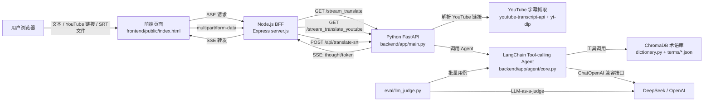

# 垂直领域智能翻译 Agent 架构说明

本项目面向“日语游戏/ACG 视频字幕翻译”场景，目标不是做通用机翻，而是通过 Agent + RAG 术语库解决游戏黑话、缩写、版本环境词等垂直领域表达的翻译问题。

## 架构图



## 模块职责

| 模块 | 技术 | 职责 |
| --- | --- | --- |
| 前端 UI | HTML/CSS/JS | 提供单句翻译、YouTube 链接翻译、SRT/TXT 文件翻译入口；默认只显示译文，可展开 Agent 思考过程。 |
| BFF 层 | Node.js + Express | 作为前端与 Python 后端之间的边界层，负责 SSE 流式转发和文件上传代理。 |
| 后端编排层 | FastAPI | 暴露翻译 API，处理 YouTube 字幕抓取、SRT/TXT 解析、Agent 调用与 SSE 输出。 |
| Agent 核心 | LangChain | 使用 tool-calling Agent 实现“分析输入 -> 调用术语工具 -> 结合检索结果翻译”的流程。 |
| 术语工具 | ChromaDB + JSON | 从 `backend/app/data/terms/*.json` 分 domain 加载；YouTube 翻译时按视频背景自动筛选 domain 检索。 |
| 评测脚本 | LLM-as-a-judge | 对 20 条术语翻译用例自动评分，输出通过率和平均分。 |

## 数据流

### 1. 单句翻译

1. 用户在页面输入一句日语游戏文本。
2. 前端发起 `GET /api/translate?text=...`。
3. Node BFF 转发到 Python 后端 `GET /stream_translate?text=...`。
4. 后端调用 LangChain Agent。
5. Agent 按需调用 `search_term_dict` 术语工具。
6. 后端用 SSE 返回两类事件：
   - `thought`：Agent 推理、工具调用、RAG 返回结果。
   - `token`：最终译文 token。
7. 前端默认只展示 `token`，用户可展开查看 `thought`。

### 2. YouTube 链接翻译

1. 用户输入 YouTube 链接。
2. 前端发起 `GET /api/translate-youtube?url=...`。
3. 后端解析视频 ID。
4. 后端优先使用 `youtube-transcript-api` 获取字幕。
5. 若被 YouTube 拦截，则回退到 `yt-dlp` 读取浏览器 cookies 并只下载字幕轨道。
6. 字幕按 `YOUTUBE_TRANSLATE_CHUNK_CHARS` 分块进入 Agent + RAG 翻译流程（流式预览逐块输出）。
7. 下载完整翻译 SRT 时走 `/stream_translate_youtube_srt`，按 `TRANSLATE_BATCH_SIZE` 分批翻译并保留时间轴。

### 3. SRT/TXT 文件翻译

1. 用户上传 `.srt` 或 `.txt`。
2. BFF 代理到 Python 后端 `POST /api/translate-srt`。
3. 后端解析文件编码和字幕条目。
4. 逐句调用 Agent 翻译。
5. 返回翻译后的文本文件供浏览器下载。

## API 文档

### `GET /`

健康检查。

响应：

```json
{"message": "Hello from Python Backend"}
```

### `GET /stream_translate`

单句流式翻译接口。

参数：

| 参数 | 类型 | 必填 | 说明 |
| --- | --- | --- | --- |
| `text` | string | 是 | 待翻译文本。 |

响应：`text/event-stream`

事件示例：

```text
data: {"type":"thought","content":"【LLM大脑】已接收任务..."}

data: {"type":"token","content":"这个角色的减益效果很强。"}

data: [DONE]
```

### `GET /stream_translate_youtube`

YouTube 字幕抓取 + 流式翻译接口。

参数：

| 参数 | 类型 | 必填 | 说明 |
| --- | --- | --- | --- |
| `url` | string | 是 | YouTube 视频链接或视频 ID。 |

响应：`text/event-stream`，事件格式同 `/stream_translate`。

环境要求：

- 国内环境通常需要配置 `YOUTUBE_PROXY`。
- 若出现 `Sign in to confirm`，需要配置 `YOUTUBE_COOKIES_FROM_BROWSER=edge/chrome/firefox` 或 `YOUTUBE_COOKIE_FILE`。

### `POST /api/translate-srt`

文件批量翻译接口。

请求：`multipart/form-data`

| 字段 | 类型 | 必填 | 说明 |
| --- | --- | --- | --- |
| `file` | file | 是 | `.srt` 或 `.txt` 文件。 |

响应：`text/plain`，带 `Content-Disposition` 下载头。

## Agent 设计

Agent 的 system prompt 明确要求：

1. 遇到疑难名词、领域黑话必须调用 `search_term_dict`。
2. 结合工具检索结果输出地道中文，而不是生硬机翻。

当前工具：

| 工具 | 输入 | 输出 |
| --- | --- | --- |
| `search_term_dict` | 待查询术语 | ChromaDB 返回的相关术语解释。 |

### 防死循环设计

`AgentExecutor` 配置了多重保护，确保 Agent 不会陷入无限“思考-调用工具”循环：

| 参数 | 默认值 | 作用 |
| --- | --- | --- |
| `max_iterations` | 5 | 限制单次请求内 ReAct 推理/工具调用的最大轮数。 |
| `max_execution_time` | 60 秒 | 单次请求最长执行时间，超时强制结束。 |
| `handle_parsing_errors` | True | 模型输出无法解析时不崩溃，返回提示让其自我修正。 |
| `early_stopping_method` | force | 触发上限时强制收尾，返回当前已有结果而非报错。 |

以上参数可通过 `.env` 中的 `AGENT_MAX_ITERATIONS`、`AGENT_MAX_EXECUTION_TIME` 覆盖。

术语库按 **domain 分文件** 存放在 `backend/app/data/terms/`（如 `gaming.json`、`cooking.json`、`general.json`）。每条术语包含：

- `term`：日语/英文原词。
- `aliases`：别名、缩写、罗马字或常见写法。
- `category`：battle、gacha、ingredient、technique 等细分类（同一 domain 内使用）。
- `translation`：推荐中文译法。
- `meaning`：领域含义解释。
- `examples`：典型例句。
- `notes`：容易误译的点。

**分库加载**：YouTube 翻译时，`term_domains.py` 根据视频标题/简介/标签/频道名推断 domain，`search_term_dict` 只检索对应词库；若无命中则自动回退全库。单句/文件上传翻译默认全库检索。

## 量化评判

`eval/llm_judge.py` 使用 20 条测试用例覆盖 `デバフ`、`バフ`、`エグい`、`ワンパン`、`ナーフ`、`CT`、`天井`、`すり抜け`、`人権キャラ`、`ギミック` 等术语。流程：

1. 调用现有 Agent 生成译文。
2. 用同一兼容 OpenAI 接口的模型作为裁判。
3. 要求裁判只返回 JSON：`pass`、`score`、`reason`。
4. 输出通过率、平均分，并保存 `eval/llm_judge_results.json`。

通过标准：

- `pass_rate >= 80%`
- `avg_score >= 4.0 / 5`

## 工程边界

- 前端/BFF 层只负责交互和流式转发，不直接调用 LLM。
- Python 后端负责 AI 编排、字幕处理、Agent/RAG 逻辑。
- YouTube 获取只抓字幕，不下载视频，避免把项目范围扩展成视频处理/ASR 管线。
- 本地开发使用 `start.ps1` / `start.sh` 一键启动 Python 与 Node 进程。
